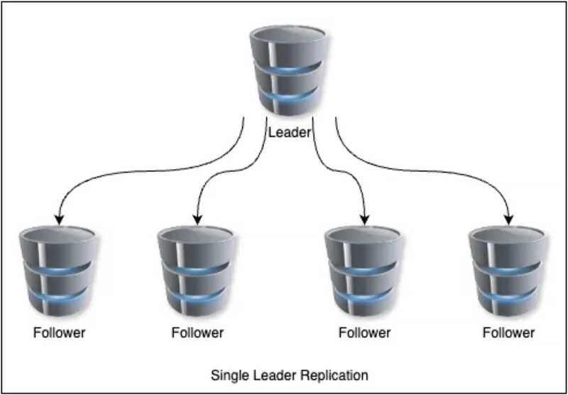

# Single-Leader Replication with Golang

---

## Как собрать и запустить Node/CLI

Проект имеет структуру монорепозитория с двумя основными пакетами: `node` и `cli`. Папка `cmd` содержит исполняемые
файлы для обоих компонентов.
Для получения бинарных файлов `node.exe` и `cli.exe`, выполните следующие команды в нужной директории:

```bash
go build
# Запуск узла
./node.exe -id=<ID> -host=<HOST> -port=<PORT>
# Запуск CLI
./cli.exe
```
---
## Краткая архитектура

- **Node**: Основной компонент, который реализует функциональность узла в кластере. Он обрабатывает запросы на чтение и
  запись, а также взаимодействует с другими узлами для репликации данных.
  Нет разделения на leader/follower внутри узла, так как роль определяется на уровне кластера. Узел может быть лидером
  или фолловером в зависимости от конфигурации кластера.

`cmd/node` содержит код для запуска узла. <br>
`internal/node` содержит логику обработки запросов и взаимодействия с другими узлами. <br>
`internal/protocol` содержит код для сетевого взаимодействия между узлами, включая сериализацию/десериализацию сообщений
и обработку протокола репликации. <br>
`internal/inmemory` содержит реализацию in-memory хранилища для данных и дедупликации.

- **CLI**: Командная строка для управления кластером. Позволяет добавлять узлы, настраивать репликацию, устанавливать
  лидера и выполнять операции чтения/записи/дампа.

`cmd/cli` содержит код для запуска CLI. <br>
`internal/cli` содержит логику обработки команд и взаимодействия с узлами.
<div style="text-align: center;">
  
</div>

---

## Спецификация протокола

Взаимодействие осуществляется поверх TCP.  
Каждое сообщение — это один JSON-объект, сериализованный в строку и завершённый символом `\n`.

Обязательное поле каждого сообщения:

```json
{
  "type": "MESSAGE_TYPE"
}
```

### CLIENT_PUT_REQUEST

```json
{
  "type": "CLIENT_PUT_REQUEST",
  "request_id": "uuid",
  "client_id": "uuid",
  "key": "string",
  "value": "string"
}
```

### CLIENT_PUT_RESPONSE

```json
{
  "type": "CLIENT_PUT_RESPONSE",
  "request_id": "uuid",
  "node": {
    "node_id": "string",
    "hostname": "string",
    "port": "int"
  },
  "status": "OK | ERROR",
  "error_code": "Optional[NOT_LEADER | NOT_ENOUGH_REPLICAS | TIMEOUT | BAD_REQUEST | UNKNOWN_NODE]",
  "error_msg": "Optional[string]"
}
```

### CLIENT_GET_REQUEST

```json
{
  "type": "CLIENT_GET_REQUEST",
  "request_id": "uuid",
  "client_id": "uuid",
  "key": "string"
}
```

### CLIENT_GET_RESPONSE

```json
{
  "type": "CLIENT_GET_RESPONSE",
  "request_id": "uuid",
  "node": {
    "node_id": "string",
    "hostname": "string",
    "port": "int"
  },
  "status": "OK | ERROR",
  "value": "string",
  "found": "bool",
  "error_code": "Optional[NOT_LEADER | NOT_ENOUGH_REPLICAS | TIMEOUT | BAD_REQUEST | UNKNOWN_NODE]",
  "error_msg": "Optional[string]"
}
```

### CLIENT_DUMP_REQUEST

```json
{
  "type": "CLIENT_DUMP_REQUEST",
  "request_id": "uuid",
  "client_id": "uuid"
}
```

### CLIENT_DUMP_RESPONSE

```json
{
  "type": "CLIENT_DUMP_RESPONSE",
  "request_id": "uuid",
  "node": {
    "node_id": "string",
    "hostname": "string",
    "port": "int"
  },
  "status": "OK | ERROR",
  "dump": {
    "<key1>": "<value1>>",
    "<key2>": "<value2>"
  },
  "error_code": "Optional[NOT_LEADER | NOT_ENOUGH_REPLICAS | TIMEOUT | BAD_REQUEST | UNKNOWN_NODE]",
  "error_msg": "Optional[string]"
}
```

### REPL_PUT

```json
{
  "type": "REPL_PUT",
  "operation_id": "uuid",
  "leader": {
    "node_id": "string",
    "hostname": "string",
    "port": "int"
  },
  "key": "string",
  "value": "string"
}
```

### REPL_ACK

```json
{
  "type": "REPL_ACK",
  "operation_id": "uuid",
  "node": {
    "node_id": "string",
    "hostname": "string",
    "port": "int"
  }
}
```

### CLUSTER_UPDATE_REQUEST

```json
{
  "type": "CLUSTER_UPDATE_REQUEST",
  "request_id": "uuid",
  "nodes": [
    {
      "node_id": "string",
      "hostname": "string",
      "port": "int"
    }
  ],
  "leader_id": "string",
  "replication_mode": "async | semi-sync | sync",
  "replication_factor": "int",
  "semi_sync_acks": "int",
  "min_delay_ms": "int",
  "max_delay_ms": "int"
}
```

### CLUSTER_UPDATE_RESPONSE

```json
{
  "type": "CLUSTER_UPDATE_RESPONSE",
  "request_id": "uuid",
  "node": {
    "node_id": "string",
    "hostname": "string",
    "port": "int"
  },
  "status": "OK | ERROR",
  "error_code": "Optional[NOT_LEADER | NOT_ENOUGH_REPLICAS | TIMEOUT | BAD_REQUEST | UNKNOWN_NODE]",
  "error_msg": "Optional[string"
}
```

### Режимы репликации

- **async**: Лидер сразу отвечает клиенту после записи локально, не дожидаясь подтверждений от фолловеров.
- **semi-sync**: Лидер отвечает клиенту после получения подтверждений от заданного числа фолловеров (semi_sync_acks).
- **sync**: Лидер отвечает клиенту только после получения подтверждений от всех фолловеров (в соответствии с replication_factor).
---
## Как запускать бенчмарки
Бенчмарки находятся в папке `benchmarks`. Для их запуска используйте команду:

```bash
python3 benchmark.py
```
После прогонов бенчмарков, результаты будут сохранены в файлах `resultsA.csv` и `resultsB.csv` в той же директории.
Там же находится файл `report.md` с анализом результатов и графиками.
---
## Какая семантика follower write: redirect или proxy
При попытке записи на фолловер, будет возвращаться ошибка `NOT_LEADER` с информацией о текущем лидере. Клиент должен использовать эту информацию для перенаправления запроса на лидера. Фолловер не будет проксировать запросы, так как это может усложнить логику обработки и увеличить задержки.