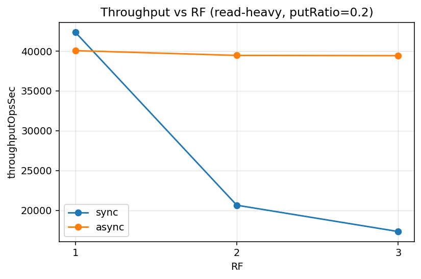
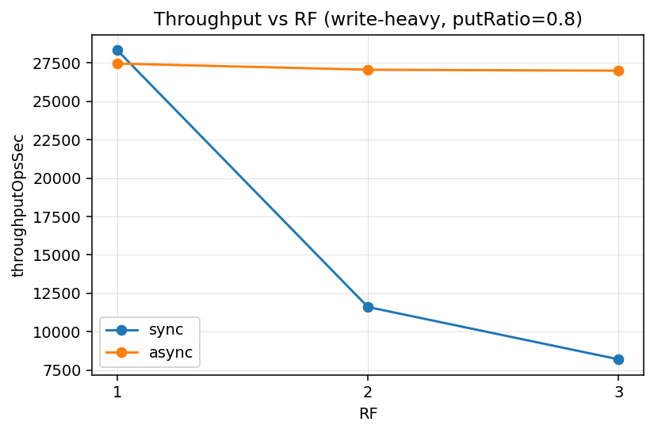
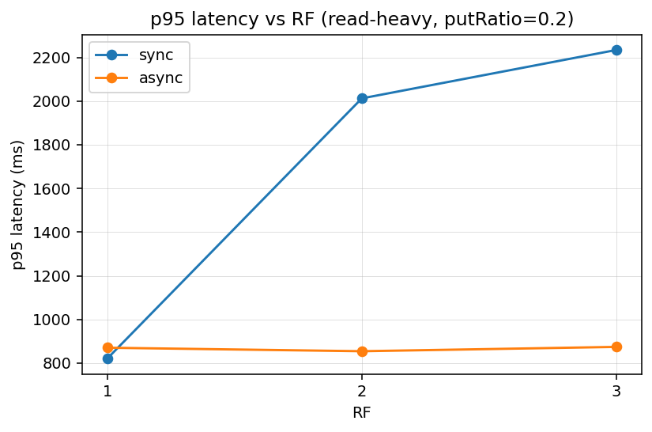
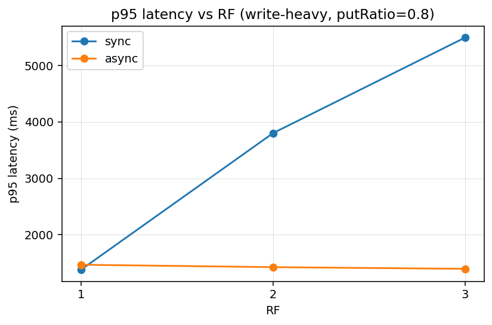
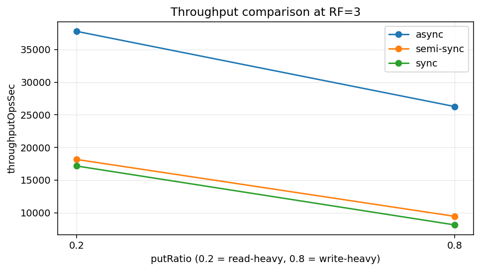

# Benchmark report

---

## Таблица результатов sync vs async

| replicationMode | rf | k  | threads | putRatio | totalOps | throughputOpsSec | avgMs    | p50Ms    | p75Ms    | p95Ms    | p99Ms    |
|-----------------|----|----|---------|----------|----------|------------------|----------|----------|----------|----------|----------|
| sync            | 1  | -1 | 16      | 0.8      | 50000    | 28342.154        | 829.614  | 823.134  | 1159.219 | 1376.971 | 1437.449 |
| sync            | 2  | -1 | 16      | 0.8      | 50000    | 11605.672        | 1999.313 | 2002.378 | 3022.780 | 3801.819 | 3952.654 |
| sync            | 3  | -1 | 16      | 0.8      | 50000    | 8195.818         | 2704.357 | 2635.681 | 4267.001 | 5498.454 | 5733.569 |
| sync            | 1  | -1 | 16      | 0.2      | 50000    | 42364.746        | 541.313  | 504.153  | 616.987  | 821.139  | 861.284  |
| sync            | 2  | -1 | 16      | 0.2      | 50000    | 20649.054        | 890.100  | 507.105  | 1388.518 | 2012.454 | 2115.145 |
| sync            | 3  | -1 | 16      | 0.2      | 50000    | 17342.612        | 939.702  | 489.832  | 1486.076 | 2234.109 | 2392.234 |
| async           | 1  | -1 | 16      | 0.8      | 50000    | 27463.966        | 848.629  | 843.321  | 1184.894 | 1465.229 | 1522.232 |
| async           | 2  | -1 | 16      | 0.8      | 50000    | 27063.796        | 833.650  | 825.875  | 1154.765 | 1422.410 | 1492.890 |
| async           | 3  | -1 | 16      | 0.8      | 50000    | 27000.861        | 828.068  | 837.993  | 1152.714 | 1392.552 | 1459.455 |
| async           | 1  | -1 | 16      | 0.2      | 50000    | 40059.747        | 589.647  | 574.164  | 695.237  | 870.513  | 922.192  |
| async           | 2  | -1 | 16      | 0.2      | 50000    | 39458.130        | 567.265  | 547.112  | 680.157  | 854.481  | 895.728  |
| async           | 3  | -1 | 16      | 0.2      | 50000    | 39428.951        | 581.884  | 548.368  | 671.761  | 874.301  | 928.735  |

## Таблица результатов sync vs semi-sync(K=1) vs async

| replicationMode | rf | k  | threads | putRatio | totalOps | throughputOpsSec | avgMs    | p50Ms    | p75Ms    | p95Ms    | p99Ms    |
|-----------------|----|----|---------|----------|----------|------------------|----------|----------|----------|----------|----------|
| async           | 3  | -1 | 16      | 0.8      | 50000    | 26275.582        | 857.480  | 828.605  | 1225.350 | 1482.577 | 1539.775 |
| semi-sync       | 3  | 1  | 16      | 0.8      | 50000    | 9462.425         | 2609.227 | 2558.136 | 4062.258 | 5310.812 | 5540.692 |
| sync            | 3  | -1 | 16      | 0.8      | 50000    | 8149.327         | 2706.119 | 2668.404 | 4229.240 | 5510.696 | 5760.151 |
| async           | 3  | -1 | 16      | 0.2      | 50000    | 37787.757        | 631.849  | 620.589  | 746.017  | 924.201  | 980.424  |
| semi-sync       | 3  | 1  | 16      | 0.2      | 50000    | 18170.581        | 946.872  | 516.948  | 1487.022 | 2243.058 | 2407.993 |
| sync            | 3  | -1 | 16      | 0.2      | 50000    | 17170.102        | 962.603  | 522.793  | 1504.188 | 2245.288 | 2420.034 |

## График throughput vs replication factor (put_ratio=0.2)

  

## График throughput vs replication factor (put_ratio=0.8)

  

## График p95 latency vs replication factor (put_ratio=0.2)

  

## График p95 latency vs replication factor (put_ratio=0.8)

    

## График throughput vs replication mode (put_ratio=0.2, put_ratio=0.8)

    

## Обоснование наблюдаемых результатов

### Почему `sync` становится медленнее при росте RF

В режиме **synchronous replication** лидер подтверждает запись клиенту только после получения подтверждений от всех необходимых реплик.

При увеличении `RF`:

- растёт число сетевых сообщений;
- увеличивается количество подтверждений (ACK), которые нужно дождаться;
- возрастает вероятность наличия «медленной» реплики;

Фактически задержка записи определяется как:
`latency ≈ latency_leader + max(latency_replica_i)`

Чем больше реплик участвует в подтверждении, тем выше вероятность, что одна из них окажется медленной.  
Это приводит к:

- росту `p95` и `p99`;
- падению `throughput`;
- особенно заметной деградации при write-heavy нагрузке.

---

### Почему `async` быстрее, но даёт stale reads

В режиме **asynchronous replication** лидер подтверждает запись сразу после локального commit, не дожидаясь реплик.

Репликация происходит фоново.

Преимущества:

- latency записи почти не зависит от `RF`;
- высокая пропускная способность;
- отсутствие ожидания сетевых подтверждений.

Недостаток:

- чтение с follower может вернуть устаревшее значение (stale read).

Таким образом, `async` повышает производительность за счёт ослабления консистентности.

---

### Что даёт `semi-sync`: почему он между `sync` и `async` и в чём риски

В режиме **semi-synchronous replication** лидер ждёт подтверждения от `k` реплик (где `1 < k < RF`), остальные догоняют асинхронно.

Это компромисс:

- меньше ожиданий, чем в `sync`;
- больше гарантий, чем в `async`.

Latency определяется как:
`latency ≈ latency_leader + max(latency_k_fastest_replicas)`

Поэтому производительность обычно находится между `sync` и `async`.

#### Риски semi-sync:

- если подтверждение получено только от `k` реплик, остальные могут отставать, поэтому возможны stale reads;
- при сбое лидера запись может отсутствовать на части узлов;
- выбор слишком малого `k` приближает поведение к `async`;
- выбор большого `k` приближает к `sync` и снижает throughput.

---

### Почему read-heavy профиль ведёт себя иначе, чем write-heavy (single-leader)

В архитектуре single-leader:

- все записи проходят через лидера;
- чтения могут выполняться с follower.

#### Write-heavy (putRatio ≈ 0.8)

- основная нагрузка — записи;
- режим репликации напрямую влияет на latency;
- `sync` резко деградирует при росте `RF`;
- различия между режимами становятся значительными.

#### Read-heavy (putRatio ≈ 0.2)

- записи редки;
- нагрузка на механизм репликации ниже;
- чтения могут распределяться по follower-узлам;
- даже `sync` демонстрирует умеренную деградацию.

Следовательно:

- в read-heavy режиме различия между режимами меньше;
- в write-heavy режиме различия усиливаются.

---

### Итог

Наблюдаемые результаты соответствуют классическим свойствам распределённых систем:

- `sync` — максимальная консистентность, меньшая производительность;
- `async` — максимальная производительность, риск stale reads;
- `semi-sync` — компромиссный вариант;
- рост `RF` усиливает влияние сетевых задержек и tail latency;
- профиль нагрузки определяет степень влияния режима репликации на throughput и latency.